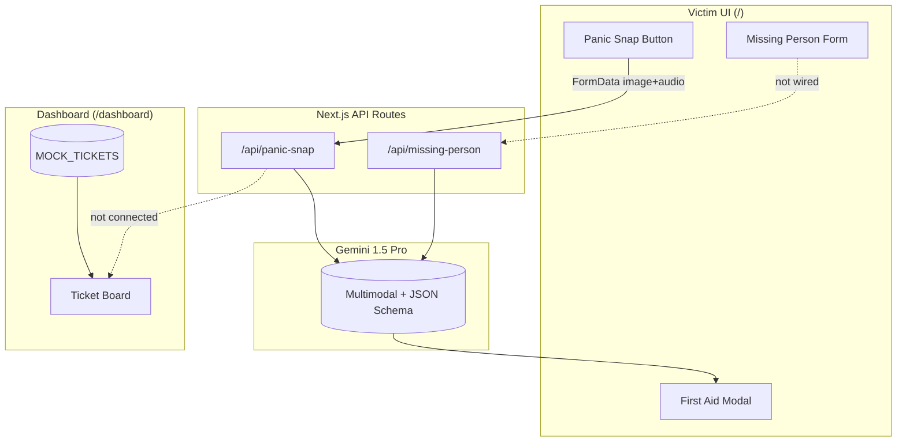

# Beacon / Crisis Copilot — Progress Report

## Project overview

**Beacon** is a hackathon-style **Crisis Copilot** app: victims use a mobile-first UI to trigger AI triage; dispatchers use a kanban-style dashboard. The runnable Next.js app lives in **`beacon/`** (App Router, Next 16, React 19, Tailwind 4). The repo root also has a minimal `package.json` with only `@google/generative-ai`; the full app dependencies are in `beacon/package.json`.

---

## What has been done

### 1. Gemini backend (API routes) — complete

Two production-style API routes were implemented and share a common Gemini layer.

| Route | Path | Input | Output |
|--------|------|--------|--------|
| Panic Snap | `beacon/app/api/panic-snap/route.ts` | `image` + `audio` (FormData files) | Crisis triage JSON |
| Missing Person | `beacon/app/api/missing-person/route.ts` | `image` + `description` (string) | Entity extraction JSON |

**Shared library:** `beacon/lib/gemini.ts`

- Initializes `GoogleGenerativeAI` from `process.env.GEMINI_API_KEY`
- Uses model **`gemini-1.5-pro`**
- Converts blobs → Gemini `inlineData` (mimeType + base64)
- Validates FormData files (`isValidFileEntry` — non-empty `Blob`)
- Forces JSON via `responseMimeType: "application/json"` + `responseSchema`
- Parses responses with fence-stripping fallback (`parseModelJson`)

**Panic Snap response fields**

- `triage_level` (1–5)
- `incident_type`
- `translated_audio`
- `visual_assessment`
- `first_aid_instructions`

**Missing Person response fields**

- `estimated_age`
- `clothing_colors[]`
- `last_known_location`
- `distinguishing_features[]`

**Error handling on both routes**

- `400` — missing/empty `image`, `audio`, or `description`
- `500` — missing API key or generic failure
- `502` — empty Gemini text or JSON parse failure
- Server-side `console.error` with route tags `[panic-snap]` / `[missing-person]`

**Removed mock backend behavior**

- Panic-snap no longer returns hardcoded triage JSON or artificial delay
- Victim UI no longer falls back to fake triage data on API failure (shows a real error message instead)

---

### 2. Type definitions — updated

`beacon/lib/types.ts` defines:

- `PanicSnapResponse` — victim + API contract
- `EmergencyTicket` — dispatcher board
- `MissingPersonReport` — report metadata (not wired yet)
- `MissingPersonExtraction` — API response for missing-person route

---

### 3. Victim-facing UI — mostly built, partially wired

| Component | Role | Backend wired? |
|-----------|------|----------------|
| `VictimApp.tsx` | Home screen, panic flow, nav to missing-person | **Partial** — calls `/api/panic-snap` |
| `PanicSnapButton.tsx` | Large emergency CTA | Yes (via parent) |
| `RecordingOverlay.tsx` | “Recording” / “Analyzing” phases | UI only |
| `FirstAidModal.tsx` | Shows triage + translated audio + first aid | Yes (when API succeeds) |
| `MissingPersonForm.tsx` | Photo upload + description | **No** — local submit only |

**Panic Snap flow today**

1. User taps button → 3s “recording” overlay (simulated)
2. Sends **placeholder** PNG + empty WebM blobs (not real camera/mic)
3. POSTs to `/api/panic-snap`
4. On success → opens `FirstAidModal` with Gemini result
5. On failure → red `role="alert"` message (no fake triage)

**Gap:** Real `getUserMedia` / `MediaRecorder` capture is not implemented; Gemini often gets minimal or invalid media.

---

### 4. Dispatcher dashboard — UI only (mock data)

| Piece | Status |
|-------|--------|
| `/dashboard` | Renders `DashboardShell` + `TicketBoard` |
| `TicketBoard` | Kanban: Incoming / Triaged / Dispatched |
| `TicketCard` | Triage badge, audio quote, visual assessment, Dispatch button |
| `mock-tickets.ts` | **Static** demo tickets — not fed by panic-snap API |

Dispatch only updates local React state (`status: "dispatched"`). No Gemini function calling, no live ticket feed.

---

### 5. Configuration

- `GEMINI_API_KEY` in repo-root `.env.local`
- Copy at `beacon/.env.local` so Next.js loads it when running from `beacon/`
- `@google/generative-ai` in `beacon/package.json` (^0.24.1)

**Note:** A full `npm run build` in this environment failed earlier due to network/install issues; you should run `npm install` and `npm run dev` locally from `beacon/` to verify.

---

## Architecture snapshot



---

## What is still mock or incomplete

| Area | Current state |
|------|----------------|
| Camera + microphone capture | Placeholder blobs in `VictimApp` |
| Missing person form → API | Submit is client-only; no `fetch("/api/missing-person")` |
| Dashboard tickets | `MOCK_TICKETS` only; panic snaps don’t create tickets |
| `visual_assessment` in First Aid modal | Returned by API but **not shown** in modal UI |
| Persistence | No DB, no localStorage ticket queue |
| Dispatcher AI actions | `.cursorrules` mentions Gemini function calling — not started |
| End-to-end demo path | Victim → dispatcher is not connected |

---

## Recommended next steps (prioritized)

### Phase A — Make the victim loop real (highest impact)

1. **Real media capture in `VictimApp`**
   - `navigator.mediaDevices.getUserMedia` for camera during “recording”
   - `MediaRecorder` for audio (or combined stream)
   - Append actual `File`/`Blob` to FormData instead of mock bytes

2. **Wire `MissingPersonForm` to `/api/missing-person`**
   - Keep selected file in state (not only data URL preview)
   - POST `image` + `description`
   - Loading overlay + show extracted tags on success (age, colors, location, features)
   - Error handling matching panic-snap pattern

3. **Surface full API data in UI**
   - Show `visual_assessment` in `FirstAidModal`
   - Parse and display API error bodies (`res.json().error`) for clearer messages

### Phase B — Connect victim to dispatch

4. **Ticket creation after panic-snap**
   - Option A (hackathon-fast): `localStorage` or in-memory store + poll/SSE on dashboard
   - Option B: simple API route `POST /api/tickets` + JSON file or lightweight DB
   - Map `PanicSnapResponse` → `EmergencyTicket` with `status: "incoming"`

5. **Replace or augment `MOCK_TICKETS`**
   - Load real tickets on dashboard mount
   - Auto-move to “triaged” when AI returns (or keep manual dispatcher workflow)

### Phase C — Dispatcher intelligence (per project rules)

6. **Gemini function calling for dispatch actions**
   - e.g. “Dispatch ambulance”, “Request structural team”, “Escalate triage”
   - Wire `TicketCard` actions to tool calls + state updates

7. **Missing person on dispatcher view**
   - New column or panel for extracted search tags
   - Link reports to search coordination UI

### Phase D — Polish and reliability

8. **Validate Gemini responses**
   - Clamp `triage_level` to 1–5
   - Zod/runtime validation after `parseModelJson`

9. **Security and ops**
   - Never commit `.env.local`; rotate key if exposed
   - Consider rate limiting on API routes for demo abuse
   - Add request size limits for uploads

10. **Testing**
    - Manual: Postman/curl with real image + audio files
    - Optional: integration test with mocked Gemini

---

## Quick “done vs. todo” checklist

| Item | Done? |
|------|-------|
| Panic-snap API with Gemini multimodal + JSON schema | Yes |
| Missing-person API with Gemini + JSON schema | Yes |
| Shared Gemini utilities | Yes |
| Env key for `beacon/` | Yes (copied) |
| Panic-snap UI calls API | Yes (with placeholder media) |
| Missing-person UI calls API | No |
| Real camera/mic capture | No |
| Dashboard live from panic snaps | No |
| Dispatcher Gemini tools | No |
| Database / persistence | No |

---

## How to run and verify locally

```bash
cd beacon
npm install
npm run dev
```

1. Open `http://localhost:3000` — trigger Panic Snap (expect weak results until real media is added).
2. Test missing-person API with curl/Postman using a real photo + description.
3. Open `http://localhost:3000/dashboard` — confirm mock kanban still works.

---

**Bottom line:** The **AI backend for both crisis flows is implemented and structured well**; the **victim panic flow is partially integrated**; the **missing-person UI and dispatcher board are still disconnected** from live data. The highest-value next step is **real media capture + wiring the missing-person form**, then **bridging panic-snap results into the dispatcher ticket board**.